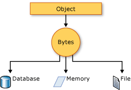

# alSerializer
Personal data serializer.

The brief for this challenge is as follows:

In Python or C++  write a command line tool which shows how you would take some sets of personal data  (name, address, phone number) and serialise them/deserialise them in at least 2 formats, and display it in at least 2 different ways (no need to use a GUI Framework - text output/HTML or any other human readable format is  fine).  There is no need to support manual data entry - you could manually write a file in one of your chosen formats to give you your input test data.

Write it in such a way that it would be easy for a developer:

to add support for additional storage formats
to query a list of currently supported formats
to supply an alternative reader/writer for one of the supported formats
This should ideally show Object-Oriented Design and Design Patterns Knowledge, we’re not looking for use of advanced Language 

constructs. Provide reasonable Unit Test coverage..

