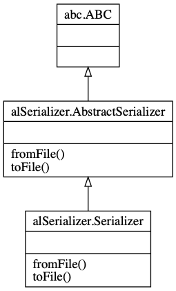
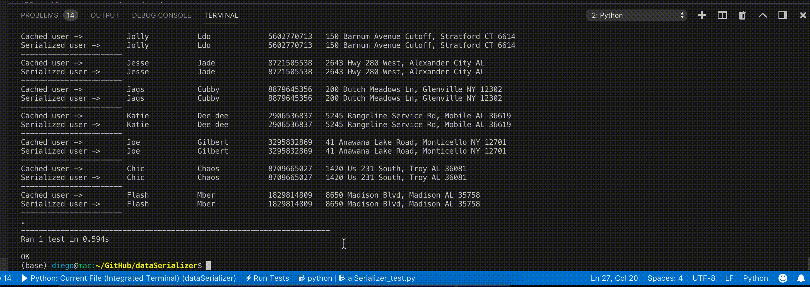

# alSerializer
#### UPDATE 01: Added support HDF5 file format.
#### UPDATE 02: Successfully implemented a web interface using a django web server with an SQLite database as back-end. This feature, although being more difficult to implement, allows the user to dynamically add entries to a db table, which is queried in real time by a django server which serves HTML requests. For details, see video at the bottom of this page. [It requires a live server running on your local host]. For any questionshoot me an email diegotrazzi@gmail.com
---
## Personal data serializer


A command line tool which takes some sets of personal data (name, address, phone number) and serialize them/deserialize them in at least 2 formats (pickle and hd5), and display it in at least 2 different ways (no need to use a GUI Framework - text output/HTML or any other human readable format is  fine).  There is no need to support manual data entry - you could manually write a file in one of your chosen formats to give you your input test data.

Write it in such a way that it would be easy for a developer:

* *Add support for additional storage formats:* To reinforce and facilitate adding new formats in future we can use class interfaces. Interfaces establish a contract (a promise) of which method will be used but all existing or future implementations. The program now supports: pickle files, hdf5 format and is also capable to write into SQLite tables to display on a live server<br/>
 
* *Query a list of currently supported formats*: added cmd line argument to retrieve list of all available formats
* *Provide reasonable Unit Test coverage:* although there would be many more tests and ways to crash this CLI, a basic unit-test has been implemented in **alSerializer_test.py**. This is how can be run:
```
python -m unittest alSerializer_test.py
```



The CLI can be run with the following options

```
Usage: alSerCmd.py [-h] [--testDataSize TESTDATASIZE] [--filePath FILEPATH]
                   --format {pk,hd5,sql}

User Serializer.

optional arguments:
  -h, --help            show this help message and exit
  --testDataSize TESTDATASIZE, -t TESTDATASIZE
                        Test the serializer with random users. Specify the
                        batch size, default 50
  --filePath FILEPATH, -p FILEPATH
                        Path to save the file (without extension). Default
                        "data/data"
  --format {pk,hd5,sql}, -f {pk,hd5,sql}
                        pk: pickle file format, hd5 or SQL. Note: sql
                        populates an SQLite DB which can be accessed through a
                        web page: http://127.0.0.1:8000/ [ It requires django
                        server to be active]

For support or feedback email diegotrazzi@gmail.com
```

The above video demonstrates how to do a static export of a .dat file (pickle). The program also supports hdf5 file format, and can dynamically upload content into an SQLite database which is then queried in real-time by a live server. A demonstration of 10,000 users procedurally generated, and uploaded to the web-server can be seen in the following video: 


NOTE: This version of the serializer has been developed on MacOS/Unix and although the code was written leveraging on path manipulation libraries to be cross-platform, it has not been tested on other platforms.

UML Class graph generated with pyreverse:
```
pyreverse alSerializer -A -a 3 -s 3 -o png -m y
```

DEBUGGING NOTES: 
To flush all tables in SQL Django db: 
```
/usr/local/anaconda3/envs/alSerializer/bin/python manage.py flush
```
To generate the proper tables in SQL we use django, which might require to migrate the models into sql for an initial setup of the tables. 
After modifying the models migrate the changes using: 
```
python manage.py makemigrations
```
```
python manage.py migrate
```