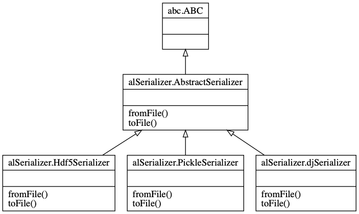

# alSerializer
Personal data serializer.


A command line tool which shows how you would take some sets of personal data (name, address, phone number) and serialize them/deserialize them in at least 2 formats, and display it in at least 2 different ways (no need to use a GUI Framework - text output/HTML or any other human readable format is  fine).  There is no need to support manual data entry - you could manually write a file in one of your chosen formats to give you your input test data.

Write it in such a way that it would be easy for a developer:

* *Add support for additional storage formats:* To reinforce and facilitate adding new formats in future we can use class interfaces. Interfaces establish a contract (a promise) of which method will be used but all existing or future implementations.<br/>
 
* *Query a list of currently supported formats*: added cmd line argument to retrieve list of all available formats
* *Provide reasonable Unit Test coverage:* although there would be many more tests and ways to crash this CLI, a basic unit-test has been implemented in **alSerializer_test.py**. This is how can be run:
```
python -m unittest alSerializer_test.py
```


The CLI can be run with the following options

```
usage: main.py [-h] [--testDataSize TESTDATASIZE]

User Serializer.

optional arguments:
  -h, --help            show this help message and exit
  --testDataSize TESTDATASIZE, -t TESTDATASIZE
                        Test the serializer with random users. Specify the
                        batch size, default 50

For support or feedback email diegotrazzi@gmail.com
```


NOTE: This version of the serializer has been developed on MacOS/Unix and although the code was written leveraging on path manipulation libraries to be cross-platform, it has not been tested on other platforms.